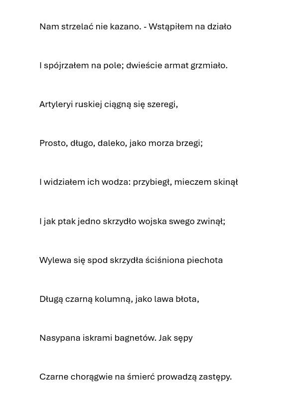
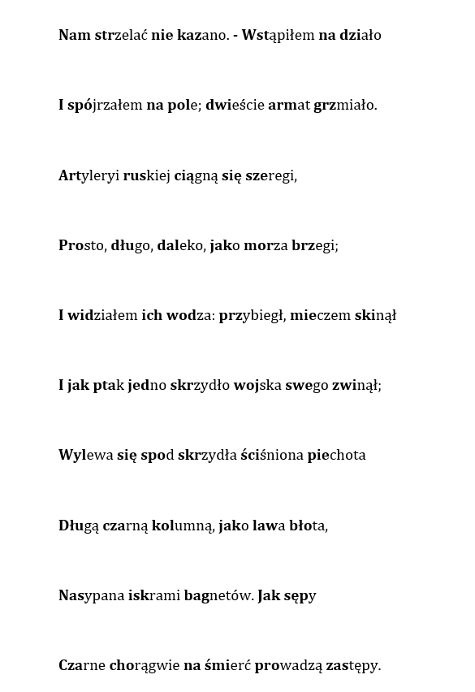

# Fattening-text

The purpose of this project is to enhance reading experience. Reaserch shows that words with mixed-style letters tend to increase focus and speed of reading.

You will be needing Docx library for manipulating the .docx files:

```bash
pip install python-docx
```

Unmodified file:


Run the file:

```bash 
python font.py
```

Modified file:
